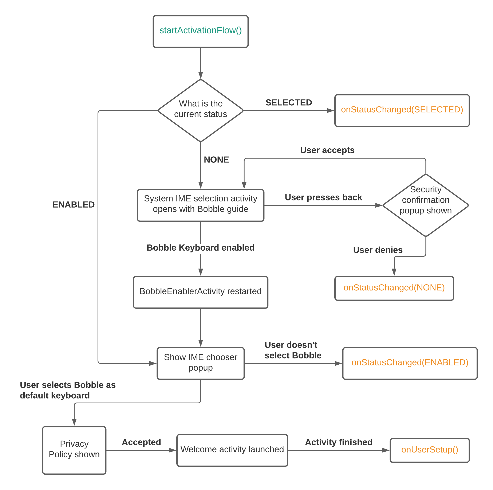

  
# BobbleIMESDK

This guide is for all app developers who wish to add a custom keyboard functionality in their Android apps using the Bobble IME (Input Method Editor) SDK via traditional method.

Note - Minimum version of supported Android platform is SDK level 21

# Table of Contents
1. [Adding BobbleIME SDK to your project](#step1)
2. [Adding permissions](#step2)
3. [Manifest changes](#step3)
4. [Other build settings](#step4)
5. [Initialise SDK](#step5)
6. [Create your custom IME Class](#step6)
7. [Refactor existing WebViews](#step7)
8. [Initiate keyboard enable and selection](#step8)
9. [Other APIs](#api)

### <a name="step1"></a>Step 1: Adding the BobbleIME SDK to your Project
Pull the latest version of the SDK from Maven as described below:

 - Include Maven in your top-level build.gradle file along with the credentials(Read URL and Read password):

```java
allprojects {
    repositories {
        maven {
            url "http://dl.appnext.com/"
        }
        maven {
            url <getReadUrl>
            credentials {
                username 'myMavenRepo'
                password <getPassword>
            }
        }
    }
}

```
- Add the following line to the dependencies element in your application module’s build.gradle.

```java
    implementation 'com.touchtalent.bobblekeyboard:keyboard:2.0.0'
```

- Sync your Gradle project to ensure that the dependency is downloaded by the build system.


### <a name="step2"></a>Step 2: Adding Permissions
##### Granting Permissions

The SDK uses the permissions granted to your app in order to improve the typing experience, and in order to suggest the most relevant content to your users.
We highly recommend that your app request the following permissions so that we can personalise user experience in a better way:
```java
<uses-permission android:name="android.permission.ACCESS_FINE_LOCATION" />
<uses-permission android:name="android.permission.RECORD_AUDIO" />
<uses-permission android:name="android.permission.READ_CONTACTS" />
```
    
    
### <a name="step3"></a>Step 3: Manifest Changes
The client needs to register the custom IME class in manifest as InputMethod service.

```java
<service
    android:name=".CustomIME"
    android:label="Bobble AI Keyboard"
    android:icon="@drawable/bobble_keyboard_icon"
    android:permission="android.permission.BIND_INPUT_METHOD">
    <intent-filter>
        <action android:name="android.view.InputMethod" />
    </intent-filter>
    <meta-data 
    	android:name="android.view.im"
       	android:resource="@xml/bobble_ime" />
</service>
```

### <a name="step4"></a>Step 4: Other Build Settings
- Add option to not compress dictionary files by following lines in the android block of your gradle
```java
aaptOptions {
    noCompress ".dict"
}
```

### <a name="step5"></a>Step 5: Initialise SDK
Inside onCreate() method of your Application class, initialise the SDK by calling
```java
BobbleIMESDK.initialise(applicationContext) 
```


### <a name="step6"></a>Step 6: Create your custom IME Class
Create a custom class declared in the manifest above.
Override the ```onQuickAccessIconTap()``` function to handle the clicks on branded icon on the keyboard.
```java
import com.touchtalent.bobbleime.services.BobbleIME;

class CustomIME extends BobbleIME {
    @Override
    public void onQuickAccessIconTap() {
        Intent intent = new Intent(this, <deep_link_activity>.class);
        intent.addFlags(FLAG_ACTIVITY_NEW_TASK);
        startActivity(intent);
    }
}
```
### <a name="step7"></a>Step 7: Refactor WebViews used within main process.
Implementing a WebView and an IME in the same process introduces a system level bug - Input boxes within the WebView cause Crashes/ANR when focused on. 

This system bug should be avoided by any of the 2 methods mentioned below -  

#### Method 1 - 

Refactor all usages of `WebView` wihtin the application to `BobbleWebView` (com.touchtalent.bobbleime.sdk.BobbleWebView). `BobbleWebView` is a extension class of `WebView` which can used within XML layouts or Java/Kotlin classes similar to `WebView`. E.g - 
```java
<com.touchtalent.bobbleime.sdk.BobbleWebView
    android:id="@+id/webView"
    android:layout_width="match_parent"
    android:layout_height="match_parent">
</com.touchtalent.bobbleime.sdk.BobbleWebView>

                    OR

WebView webView = new BobbleWebView(context);
```
<div align="center"> <b>OR</b> </div>

#### Method 2 - 

Create your own custom class extending `WebView`/ modify exisiting extension class of `WebView` by overriding `onCreateInputConnection(EditorInfo)` as described below.
```java
public class CustomWebView extends WebView {

    @Override
    public InputConnection onCreateInputConnection(EditorInfo outAttrs) {
        outAttrs.privateImeOptions = "BobbleBuggyEditText";
        return super.onCreateInputConnection(outAttrs);
    }
}
```
P.S - Adopting one of the above methods is mandatory for smooth functioning of the keyboard within WebViews of your application. Invoking keyboard inside plain WebView will result in Crashes/ANR.

### <a name="step8"></a>Step 8: Initiate keyboard enable and selection
Last step would be to initiate keyboard enabling flow. Create a new activity by extending ```BobbleEnablerActivity``` which would act as a entry point for the complete enabling flow. Use following functions and callbacks to start/track progress.

1. ```getStatus()``` - To know the current status and prepare the UI accordingly.
2. ```startActivationFlow()``` - Calling this will evaluate the current status and initiate the enabling flow accordingly.
3. ```onStatusChange(BobbleIMESDK.IMEInstallStatus status)``` - This callback is received when the enabling flow is complete. ```status``` is one of the following : 
 - SELECTED : User enabled and selected the keyboard as well.
 - ENABLED : User just enabled the keyboard but did not select it as the default one.
 - NONE : User did not do anything and returned from the settings pages. This can be used to initiate any client side flow for educating users on how to enable it.
 4. ```onUserSetup()``` - The user has succesfully been onboarded. At this point, consider redirecting user to the home page of your application.

The following flowchart shows the enabling process and the state in which each callback is fired:

<p align="center">
  
</p>

 P.S - The activity extending ```BobbleEnablerActivity``` may restart during the enabling flow because of system limitations. Care has to be taken to maintain activity state. If user presses back on this screen, it is possible that the system's IME chooser activity opens instead of the parent activity. To prevent this and maintain the navigation consider adding this in your activity :

 ```java
  @Override
    public void onBackPressed() {
        finish();
        Intent intent = new Intent(this, <parent_activity>.class);
        intent.addFlags(Intent.FLAG_ACTIVITY_REORDER_TO_FRONT);
        startActivity(intent);
    }
```

### <a name="api"></a>APIs


#### Check if keyboard is enabled
```java
boolean BobbleIMESDK.isKeyboardEnabled()
```
This API can be used to check if the keyboard is enabled inside the global input method settings.

#### Check if keyboard is selected
```java
boolean BobbleIMESDK.isKeyboardSelected()
```
This API can be used to check if the keyboard is the current selected input method editor in the system.

#### Set default language for SDK
```java
boolean BobbleIMESDK.setDefaultLanguage(BobbleSupportedLanguage language)
```
Supported languages :
```java
enum BobbleSupportedLanguage{
    ENGLISH,
    BAHASA
}
```

This API can be used to set default language for SDK.

